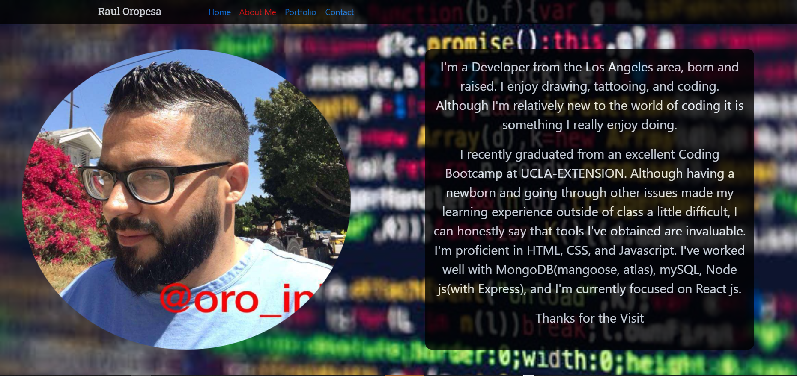

# React Portfolio

## Description

---

created a dynamic Portfolio with React.

## Table of content

---

- [Description](#description)
- [Table of content](#table-of-content)
- [Installation](#installation)
- [Setup](#setup)
- [Deploying](#deploying)
- [Contributing](#contributing)
- [Support/Questions](#supportquestions)
- [License](#license)

## Installation

---

> **_get started_**:

- node js
- React js

## Setup

---

- npm install
- npm i react-router-dom --save
- npm i bootsrap

---

---

---

---

## Deploying

---

- Heroku

> **_Find me on Github:_**

**_At Github:_**
<https://github.com/Rauloropesa3/react_portfolio.git>

**_Check out my React Portfolio Video_**
<https://drive.google.com/file/d/1sONPXHhJGyeVB1_H5zLzDTaVmyQBclDC/view>

**_Checkout my Portfolio on Heroku_**
<https://fierce-journey-90370.herokuapp.com/>

## Contributing

---

**_step 1_**

- **Option 1**

  - Fork this repo!

- **Option 2**
  - Clone thr repo to your local machine

**_step 2_**

- Hack Away!!!
- Create a new pull request

## Support/Questions

---

Reach out!

- Via email:
  - alexoropes1982@yahoo

## License

---

- MIT License

  <https://opensource.org/license/>

  >
